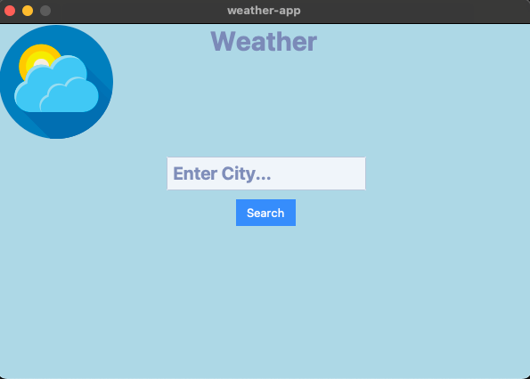

# Weather App

The **Weather App** is a simple desktop application that provides real-time weather information for a given city. It utilizes the OpenWeatherMap API to fetch weather data and presents it in an easy-to-understand graphical interface.

## Features

- **City Input:** Enter the name of the city you want to check the weather for.
- **Weather Information:** Get detailed information, including the current weather description and temperature.
- **Temperature Units:** View temperature in both Fahrenheit and Celsius.
- **User-friendly Interface:** The application provides a clean and intuitive interface for a seamless user experience.

## Screenshots




## Prerequisites

Before running the Weather App, make sure you have the following installed:

- Python 3
- `ttkbootstrap` library
- `Pillow` (PIL) library
- `tkinter` library
- `requests` library

You can install the required libraries using the following command:

```bash
pip install ttkbootstrap Pillow requests
```
## How to run

Clone this repository:
```bash
git clone https://github.com/OwenOrcan/weather-app.git
cd weather-app
```
Run the application:
```bash
python3 weather_app.py 
```
## Usage
1. Launch the application.
2. Enter the name of the city you want to check the weather for in the provided entry field.
3. Press the "Search" button or press `Enter` to get the weather information.
4. View detailed weather information, including description and temperature.
5. Optionally, go back to the main menu to search for another city.

## Contributing
If you want to contribute to the project, feel free to submit issues or pull requests. Contributions are always welcome!

## License
This project is licensed under the [MIT LICENSE](https://github.com/OwenOrcan/weather-app?tab=MIT-1-ov-file)


